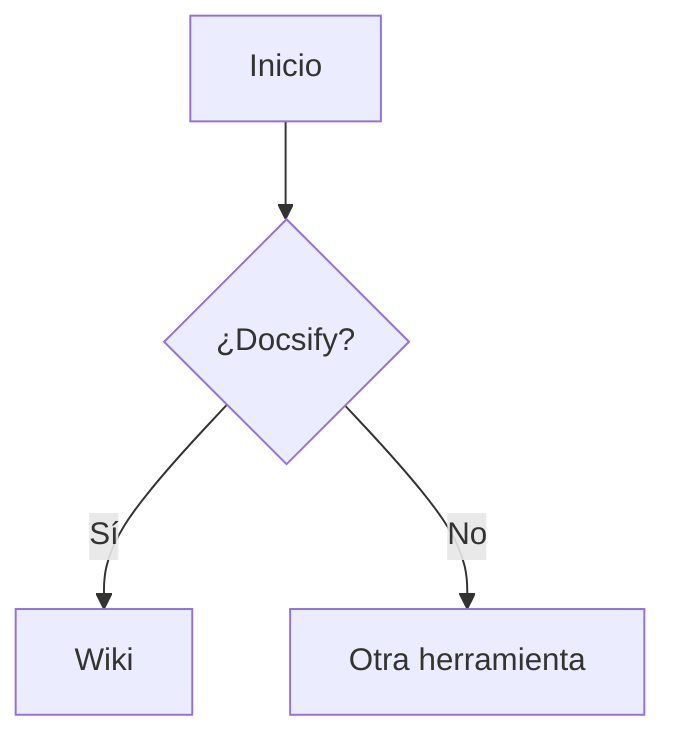

# Diagramas Mermaid

Puedes crear diagramas de flujo, Gantt, etc.

```markdown

```mermaid
graph TD;
  A[Inicio] --> B{¿Docsify?};
  B -- Sí --> C[Wiki];
  B -- No --> D[Otra herramienta];
```
```

Ejemplo:


```mermaid
graph TD;
  A[Inicio] --> B{¿Docsify?};
  B -- Sí --> C[Wiki];
  B -- No --> D[Otra herramienta];
```
